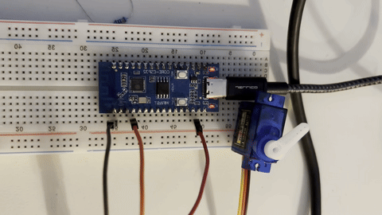

## Setup
**Device**: ESP32C3

### Arduino IDE Setup

1. Add expressif to additional board manager urls under `preferences -> Additional board manager urls`
`https://espressif.github.io/arduino-esp32/package_esp32_index.json`

2. Install Expressif Arduino C3 dev module

3. Other settings:
  -  Tools → Board → ESP32 Arduino → ESP32C3 Dev Module
  -  Tools → USB CDC On Boot → "Enabled"
  -  Tools → Upload Mode → "UART0 / Hardware CDC"
  -  Tools → USB Mode → "Hardware CDC and JTAG"
  -  Tools → Partition Scheme → "Default 4MB with spiffs"
  -  Tools → Flash Size → "4MB (32Mb)"

4. Install the ESP32Servo Library

## Test Code:

```C
#include <ESP32Servo.h>  // ESP32Servo library

// Create servo object
Servo myServo;

// Define servo pin
#define SERVO_PIN 3  

// Servo positions
int pos = 0;  

void setup() {
  Serial.begin(115200);
  
  // Allow allocation of all timers for servo library
  ESP32PWM::allocateTimer(0);
  ESP32PWM::allocateTimer(1);
  ESP32PWM::allocateTimer(2);
  ESP32PWM::allocateTimer(3);
  
  // Attach servo to GPIO pin
  myServo.attach(SERVO_PIN, 1000, 2000);  // (pin, min_pulse_width, max_pulse_width)
  
  Serial.println("ESP32-C3 SG90 Servo Control Started");
  Serial.println("Servo will sweep from 0° to 180° and back");
  
  // Start servo at middle position
  myServo.write(90);
  delay(1000);
}

void loop() {
  // Sweep from 0 to 180 degrees
  Serial.println("Sweeping 0° to 180°");
  for (pos = 0; pos <= 180; pos += 1) {
    myServo.write(pos);              // Tell servo to go to position 'pos'
    Serial.print("Position: ");
    Serial.print(pos);
    Serial.println("°");
    delay(1);
  }
  
  delay(500);  // Pause at 180°
  
  // Sweep from 180 to 0 degrees
  Serial.println("Sweeping 180° to 0°");
  for (pos = 180; pos >= 0; pos -= 1) {
    myServo.write(pos);             
    Serial.print("Position: ");
    Serial.print(pos);
    Serial.println("°");
    delay(1);    
  }
  
  delay(500);  // Pause at 0°
}
```

After uploading the code connect the servo like this:

```
ESP32-C3                    SG90 Servo
                           ┌──────────┐
[3.3V] ──────────────────→ │ RED      │
[GND]  ──────────────────→ │ BROWN    │
[GPIO3] ─────────────────→ │ ORANGE   │
                           └──────────┘
```
You should see something like this:




## Send Messages via MQTT

Install mosquitto server on your machine and run it.

```bash
brew install mosquitto
brew services start mosquitto
```

Next you'll need edit mosquitto server config to allow connections from the network. Edit the file `/usr/local/etc/mosquitto/mosquitto.conf` and add the following line:

```bash
listener 1883 0.0.0.0
allow_anonymous true
```

Make sure to use a username and password for production system.

Next you'll need to install mosquitto client on your machine. You can use it to test the connection. For now restart the mosquitto service to apply the changes.

```bash
brew services restart mosquitto
```

That should be enough to send messages to the module via MQTT.